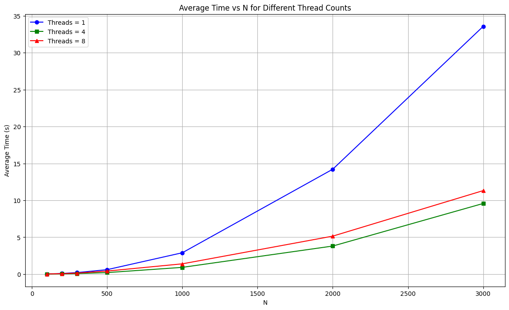
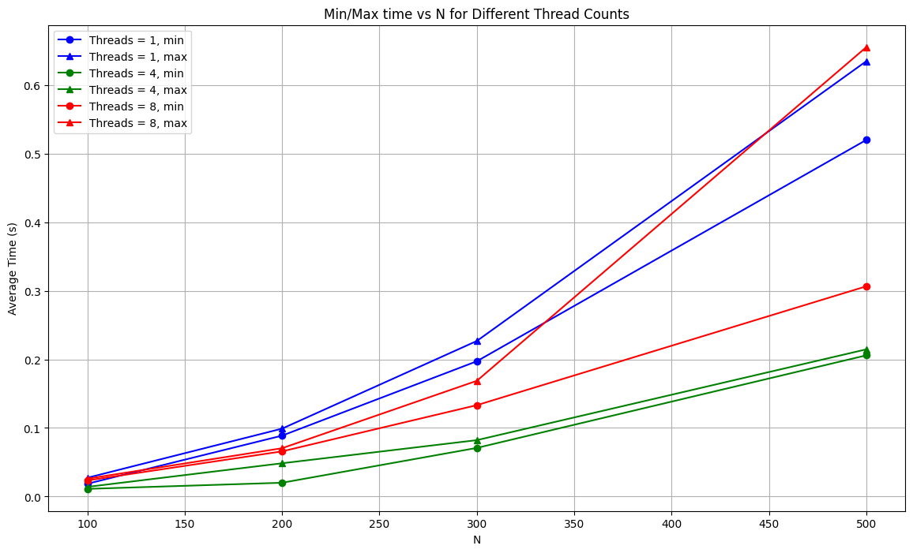

## Отчёт по результатам численного решения задачи Дирихле для уравнения Пуассона

### Методы и алгоритмы

Используемый алгоритм основан на методе волновой обработки данных (алгоритм 11.6 из упомянутой ниже книги). Для распараллеливания вычислений применена библиотека OpenMP.

#### [Код реализации ](main.c)

### Результаты экспериментов

Эксперименты проводились на MacBook Pro (2019) с процессором 2.6 GHz 6-Core Intel Core i7, 32 GB памяти и macOS Ventura 13.3.1. Измерялись времена выполнения алгоритма для различных размеров задач (N) и количеством потоков (1, 4, 8). Запуск в каждой конфигурации проводился 100 раз, на основе чего построены максимум/минимам/среднее/медиана.

| Threads | N    | Average Time | Min Time  | Max Time  | Median Time |
|---------|------|--------------|-----------|-----------|-------------|
| 1       | 100  | 0.021761     | 0.018609  | 0.027319  | 0.020208    |
| 1       | 200  | 0.093877     | 0.088800  | 0.099007  | 0.093221    |
| 1       | 300  | 0.212510     | 0.197278  | 0.226870  | 0.212644    |
| 1       | 500  | 0.607814     | 0.520075  | 0.634901  | 0.609384    |
| 1       | 1000 | 2.898312     | 2.761268  | 3.034374  | 2.878536    |
| 1       | 2000 | 14.215007    | 13.265214 | 15.852016 | 14.021412   |
| 1       | 3000 | 33.561372    | 33.098426 | 34.165772 | 33.530723   |
| 4       | 100  | 0.011800     | 0.011134  | 0.014034  | 0.011485    |
| 4       | 200  | 0.038487     | 0.020086  | 0.048498  | 0.038680    |
| 4       | 300  | 0.079076     | 0.070884  | 0.082206  | 0.080662    |
| 4       | 500  | 0.210791     | 0.205902  | 0.214640  | 0.210558    |
| 4       | 1000 | 0.919021     | 0.865524  | 1.217459  | 0.886039    |
| 4       | 2000 | 3.806511     | 2.648210  | 4.461677  | 3.875975    |
| 4       | 3000 | 9.572734     | 9.051587  | 10.584245 | 9.512096    |
| 8       | 100  | 0.024471     | 0.023465  | 0.025980  | 0.024250    |
| 8       | 200  | 0.067948     | 0.065859  | 0.070438  | 0.067538    |
| 8       | 300  | 0.143895     | 0.133230  | 0.168768  | 0.138487    |
| 8       | 500  | 0.417637     | 0.306595  | 0.655385  | 0.379671    |
| 8       | 1000 | 1.396643     | 1.207272  | 2.060207  | 1.342213    |
| 8       | 2000 | 5.149535     | 4.566655  | 5.619607  | 5.211417    |
| 8       | 3000 | 11.315246    | 10.485080 | 12.024240 | 11.376537   |

### Анализ результатов

#### Влияние количества потоков

1. При увеличении количества потоков с 1 до 4 наблюдается значительное уменьшение времени выполнения для всех размеров задач. Это объясняется более эффективным использованием многопроцессорной архитектуры.

2. При дальнейшем увеличении количества потоков до 8 эффективность параллелизации немного уменьшается для некоторых размеров задач (например, для N = 100 и 200). Это может быть связано с накладными расходами на синхронизацию потоков и разделение нагрузки. Это так же моэно заметить, посмотрев на сводные данные по min/max и увидев, что некоторые худшие запуски на 8-ми потоках делаются дольше, чем лучшие на 4х.

#### Влияние размера входных данных

1. С увеличением размера входных данных (N) время выполнения алгоритма увеличивается как для однопоточного, так и для многопоточного выполнения. Это ожидаемо, так как увеличение N приводит к увеличению количества вычислений.

2. Для больших размеров задач (N >= 1000) параллелизация показывает большую эффективность, что подтверждается значительным уменьшением времени выполнения при увеличении количества потоков.

### Заключение

Проведенные эксперименты показали, что использование метода волновой обработки данных с распараллеливанием при помощи OpenMP позволяет значительно ускорить решение задачи Дирихле для уравнения Пуассона. Наиболее эффективное уменьшение времени выполнения наблюдается при использовании 4 потоков, тогда как дальнейшее увеличение количества потоков до 8 не всегда приводит к существенному ускорению.

Результаты данного исследования могут быть полезны для дальнейшего улучшения алгоритмов параллельного решения дифференциальных уравнений в частных производных и их применения в высокопроизводительных вычислительных системах.

### Библиография

Гергель В. П. “Высокопроизводительные вычисления для многоядерных многопроцессорных систем” (2010).