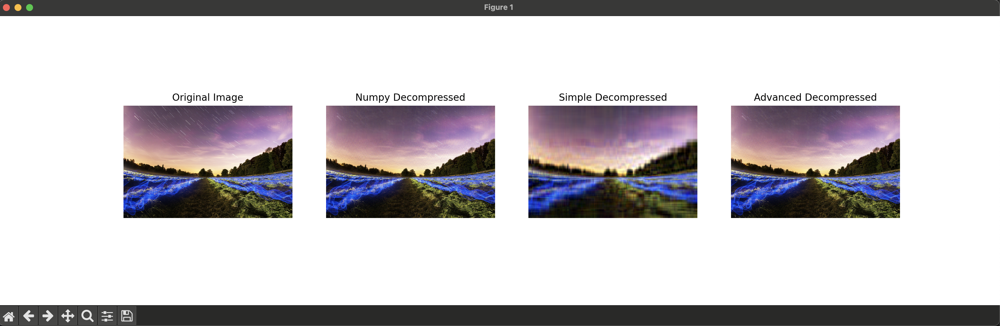
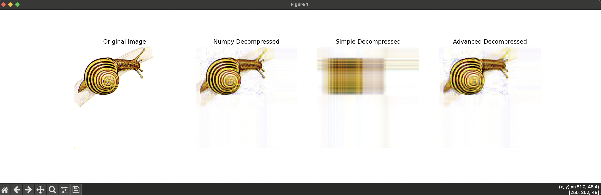

### 1. Документация формата промежуточного представления

Формат промежуточного представления сохраняется с использованием `pickle`, который сохраняет данные в бинарном формате и сжимает их. Промежуточный файл содержит:

- Матрицы U, S и V для каждого цветового канала (R, G, B).
- Количество сохранённых сингулярных значений \( k \).

Пример структуры сохраненного файла:
```
{
    'Ur': <matrix U for red channel>,
    'Sr': <vector S for red channel>,
    'Vr': <matrix V for red channel>,
    'Ug': <matrix U for green channel>,
    'Sg': <vector S for green channel>,
    'Vg': <matrix V for green channel>,
    'Ub': <matrix U for blue channel>,
    'Sb': <vector S for blue channel>,
    'Vb': <matrix V for blue channel>,
}
```

### 2. Обоснование выбора алгоритмов

#### Методы сингулярного разложения:

- **Numpy**: Использование встроенного метода SVD из библиотеки numpy. Это наиболее эффективный метод благодаря оптимизации и использованию низкоуровневых библиотек.
  
- **Simple**: Реализация SVD на основе метода итераций мощности для нахождения собственных значений и векторов. Этот метод является базовым и используется для демонстрации простоты реализации.

- **Advanced**: Итеративное применение QR-разложения к матрице для нахождения ортогональных матриц и приближений собственных значений.
Процесс повторяется до тех пор, пока изменение в диагональных элементах не станет меньше заданного порога. Затем на основе ортогональной матрицы, найденной при помощи QR-итераций, вычисляются сингулярные значения и векторы. Вектора сингулярных значений вычисляются из собственных значений матрицы.

Взято из: "Matrix Computations" by Gene H. Golub and Charles F. Van Loan: (главы 7-8, но может зависеть от редакции)

### 3. Анализ результатов сжатия и восстановления

Для анализа выберем достаточно большое изображение и проведём сжатие с разными методами SVD. Затем сравним сохранённость ключевых признаков изображения.


### [Пример реализации аналитической части](image.png)

### Пояснения к коду

1. **calculate_mse**: Функция для расчёта средней квадратической ошибки (MSE) между оригинальным и восстановленным изображением.
2. **compress_image_svd** и **decompress_image_svd**: Используются для сжатия и восстановления изображений с разными методами SVD.
3. **Сохранение и загрузка сжатых данных**: Для демонстрации сохранённых данных.
4. **MSE и визуализация**: Вычисление MSE и визуальное сравнение для оценки качества восстановления.

### Заключение

MSE for Numpy method: 808.6104044596354

MSE for Simple method: 2238.285284423828

MSE for Advanced (QR) method: 684.9562072753906

Проверить на любой картинке можно, запустив эксперпемент `exp.py` (в images есть пара интересных примеров разных картинок на которых отчётлива видна разница в эфффективности)

Путём эксперементов я заметил, что на фотографии с тонкими линиями, текстурами, или архитектурными деталями.

Такие изображения содержат множество высокочастотных компонентов, которые сложно эффективно аппроксимировать с помощью низкорангового SVD.

Например, картинки с текстом очень страдают от такого сжатия (например улиточке стало плохо)





MSE for Numpy method: 796.6309661865234
MSE for Simple method: 5340.079986572266
MSE for Advanced method: 1216.2470703125


